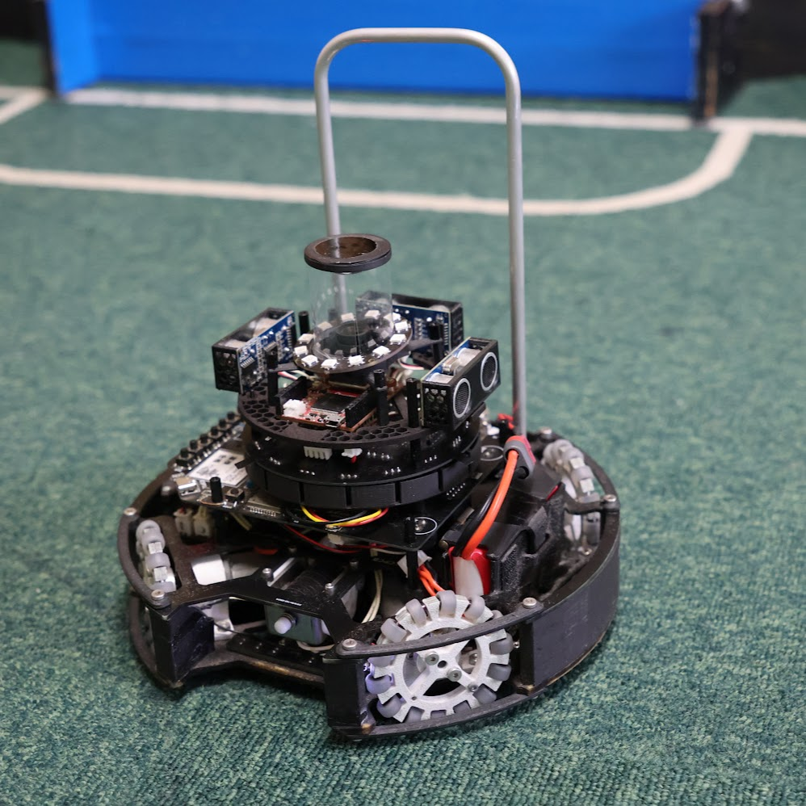

# Singularity2025 - ロボカップジュニア競技用プログラム

このプログラムは、**Singularity2023 ジャパンオープン機体**をベースに、  
2025年に再調整・最適化を行ったものです。  
第三者でも理解しやすく、調整しやすい設計を重視して開発しています。

---

## プロジェクト背景と目的

2023年の選手時代には搭載機能を十分に活かしきれなかった反省から、  
ソフトウェアの見直しを中心に、機体が本来持つ性能を最大限に引き出すことを目標としています。  

ハードウェア面は不具合修正や信頼性向上のメンテナンスに留め、新機能の追加は行っていません。

---
## Singularity's Concept

### “本格的”なサッカーを目指して

#### 1. 狙いは外さない  
2022年度より増設した16個のボールセンサーと、  
OpenMV＋双曲面ミラーによる全方位視野でボールとゴールの位置を高精度に検出。  
得点チャンスでは、ゴールの位置をリアルタイムに認識し、最適なシュートコースを選択して確実に得点を狙う。  
さらに、距離センサーとの連携により、敵を避ける回避動作やフェイントも実装。

#### 2. 抜群のコンビネーション  
ESP32を搭載し、前年度よりも大容量かつ安定した無線通信を確立。  
2台のロボット間で位置・役割・ボール情報などを共有可能に。  
フォワードとゴールキーパーの自動切り替えや、ロボット間での全自動パス&シュートも理論上実現可能な構成。

#### 3. 退場なんてありえない  
2023年から変更された新コートにも適応できるよう、円形と十字型を組み合わせたラインセンサを採用。  
マルチプレクサにより32個のラインセンサをすべてアナログで読み取ることができ、閾値の調整も容易。  
ライン上での自己位置を把握し、押し出されても自力で復帰できる。  
ライン外のボールにはライントレース制御で自然に追従し、なめらかで正確な動きを実現。

#### 4. 圧倒的処理性能 
Teensy 3.5の高性能なCPUにより、1秒間に500回以上の制御ループを安定実行。  
ライン見落としや応答遅延がなく、信頼性の高い挙動を保証。  
さらに、10秒未満でプログラムの書き込みが可能なため、迅速に調整が行える。

---

## ロボット構成

| 項目           | 使用部品 / モジュール                 |
| -------------- | ----------------------------------- |
| メインマイコン | Teensy 3.5                         |
| 無線通信マイコン | ESP32                              |
| ボールセンサ   | TSSP58038 × 16                     |
| ラインセンサ   | NJL7502L × 62（32個分として使用） |
| ジャイロセンサ | BNO055                            |
| 超音波センサ   | HC-SR04 × 3                       |
| 全方位カメラ   | OpenMV H7 + 双曲面ミラー           |
| ディスプレイ   | SSD1306                           |
| モーター         | DIGILENT IG22 19:1 または Maxon RE16 19:1 × 4 |
| モータードライバ | TB6643KQ × 4                      |
| キッカー       | ソレノイド CB1037                  |
| 昇圧回路       | XL6009                           |
| バッテリー     | KYPOM Li-Po 3S 1000mAh             |

---

## ソースファイル構成（`src/`）

| ファイル名               | 内容・役割                                       |
| ------------------------ | ------------------------------------------------ |
| `main.cpp`               | 試合用メイン制御プログラム。サッカーの試合ロジックやモード管理。    |
| `Pins.h`                 | ピン配置を一元管理し、仕様変更時のメンテナンスや対応を容易に。           |
| `UI.cpp / UI.h`          | OLEDディスプレイやボタン操作などのユーザーインターフェース。   |
| `device.h`               | 複数情報をまとめる構造体を定義し、引数を簡潔に。           |
| `game.h`                 | おまけのミニゲーム機能。       |
| `move.cpp / move.h`      | モーター制御と移動計算を実装。     |
| `sensors.cpp / sensors.h`| センサー情報の取得・処理を担当。                      |
| `instance.cpp / instance.h`| クラスのインスタンス宣言をまとめ、`main.cpp`の整理に貢献。         |

---

## 信頼性と安定性へのこだわり

本機体の重要な目標は、  
**ラインアウトしない確実な動作**と、  
**故障や誤動作のない堅牢な設計**です。

- ラインセンサの細かな調整により安定したライン制御を実現。  
- 電気回路やモーター制御の信頼性を高め、長時間の安定稼働を追求。  
- 高速処理が可能な Teensy 3.5 を活用し、センサ情報の迅速かつ高精度な処理を実現。

---

## 開発方針

- **誰でも読みやすく調整しやすいコード**を目指し、パラメータは明示的に管理。  
- 機能ごとにモジュールを分け、保守・拡張を容易に。  
- 2023年機体に搭載されていた機能を、2025年版のソフトウェアで**フルに活用できるよう再調整**。

---

## 備考

本プログラムでは、選手時代から長年取り組んできた「ライン際でのスムーズな移動」の実現に特にこだわっています。  
誤作動のない安定したラインセンサと高速な処理性能、プログラムの工夫により、ラインアウトを防ぎつつ自然な動きを可能にしました。  
ぜひ動作にも注目してください。

私たちのプレゼンテーションシートは以下のリンクからご覧いただけます。  
[Singularity2023プレゼンテーションシート](https://x.com/Singularity_rcj/status/1641685925020463106)

---

## 開発者連絡先

- Twitter (X): [@MiyRobo](https://twitter.com/MiYRobo)  
- Email: [ymiya.singularity.rcj@gmail.com](mailto:ymiya.singularity.rcj@gmail.com)
- ご質問やフィードバックはお気軽にどうぞ。

---
